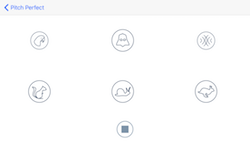

# Pitch Perfect
The Pitch Perfect recording app uses AVFoundation to mix your voice into different sounds.
Ie. you could record your voice and make it sound like a chipmunk, darth vader, or an echo.. etc.

## Playback modes
- echo
- vader
- reverb
- chipmunk
- slow
- fast

## Some of the experience I gained
- Creating adaptable user interfaces using AutoLayout and stack views
- Using AVFoundation to record and playback audio

